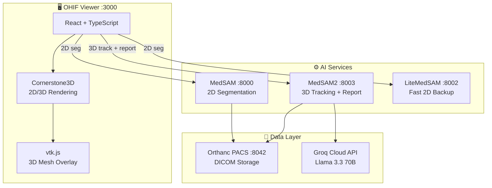

<p align="center">
  
  
  
  
</p>

<h1 align="center">MISCADA — Medical AI Diagnostic Platform</h1>

<p align="center">
  <b>AI-powered CT segmentation · 3D volume rendering · Automated radiology reports</b><br/>
  From brush stroke to diagnostic report — one seamless workflow
</p>

---

## 🎬 Demo

<!-- TODO: Insert demo video link after recording -->
<p align="center">
  <i>🎥 Full workflow walkthrough — 2D segmentation → 3D tracking → AI report generation</i>
</p>

<p align="center">
  <a href="#"></a>
</p>

---

## 🏗️ Architecture



---

## ✨ Key Features

### 2D AI Segmentation
- **Rectangle or brush prompt** — draw on any CT slice, SAM finds the lesion boundary
- **DICOM-native** — backend reads directly from Orthanc PACS, no screenshot distortion
- **Post-clip intersection** — SAM output intersected with brush area for precise lesion mask
- **Screenshot capture** — save the segmented view for report embedding

### 3D Volumetric Tracking
- **MedSAM2 propagation** — single-slice prompt spreads to full 240-slice 3D mask
- **Marching cubes mesh** — automatic 3D surface reconstruction from voxel masks
- **DICOM coordinate alignment** — vertices in patient LPS coordinates, auto-aligned with CT volume via `ImagePositionPatient` + `ImageOrientationPatient` + `PixelSpacing`
- **Real-time progress** — polling endpoint tracks forward & reverse propagation

### AI Radiology Report
- **Groq Llama 3.3 70B** — clinical-grade English reports, free API
- **Multi-agent pipeline** — Analyze → Evaluate → Report
- **Clinical context input** — patient history, lab values, symptoms
- **Auto organ detection** — DICOM metadata (`BodyPartExamined`, `SeriesDescription`)
- **Professional PDF** — jsPDF native text + embedded 2D/3D images, A4 format

### 3D Visualization
- **vtk.js volume rendering** — interactive CT with semi-transparent green mesh overlay
- **Zero manual alignment** — mesh auto-positioned via DICOM origin + direction matrix + z-shift

---

## 🚀 Quick Start

### Prerequisites

| Component | Requirement |
|-----------|------------|
| Python | 3.8+ |
| Node.js | 16+ with `yarn` |
| Orthanc | Running on `:8042` with DICOM loaded |
| RAM | 8GB+ (16GB recommended) |
| GPU | Optional — CPU inference supported |

### 1. Start Backends

```bash
# MedSAM 2D segmentation
cd MedSAM-main
pip install -r requirements_services.txt
python medsam_service.py          # → :8000

# MedSAM2 3D tracking + report
cd ../MedSAM2
python medsam2_service.py         # → :8003
```

### 2. Start Frontend

```bash
cd miscada-project-master
yarn install
yarn start                         # → :3000
```

### 3. Open

```
http://localhost:3000
```

### Workflow

```
Brush lesion → Auto Segment Organ → Apply MedSAM Model → Review 2D Preview
  → Capture 2D Screenshot → Accept & Start 3D Tracking
    → Capture 3D Screenshot → Generate AI Report
      → Fill Organ + Clinical Context → Download PDF ✅
```

---

## 🛠️ Tech Stack

| Layer | Technology |
|-------|-----------|
| **Frontend** | React 18, TypeScript, OHIF Viewer 3.x, Cornerstone3D, vtk.js |
| **2D AI** | MedSAM (ViT-B), LiteMedSAM, FastAPI, PyTorch |
| **3D AI** | MedSAM2 (SAM2 Video Predictor), NumPy, OpenCV, scikit-image |
| **Report LLM** | Groq API, Llama 3.3 70B Versatile |
| **PDF** | jsPDF — native text layout with embedded images |
| **PACS** | Orthanc DICOM Server |
| **Coordination** | DICOM IPP + IOP + PixelSpacing — same coordinate system across all layers |

---

## 📂 Project Structure

```
miscada-project-master/extensions/cornerstone/src/
  commandsModule.ts              ← Core logic: 2D SAM, 3D mesh, report flow
  components/
    ReportModal.tsx              ← AI report display + PDF generation
    Segmentation3DMeshModal.tsx

MedSAM-main/
  medsam_service.py              ← 2D segmentation (:8000)

MedSAM2/
  medsam2_service.py             ← 3D tracking + report (:8003)
  analyze_agent.py               ← Lesion metrics (volume, area, sphericity)
  evaluate_agent.py              ← 6 validation checks
  report_agent.py                ← Groq LLM report generation

MedSAM-LiteMedSAM/
  lite_medsam_service.py         ← Fast 2D fallback (:8002)
```

---

## 📖 Docs

| Document | Topic |
|----------|-------|
| [代码流程详解](./代码流程和功能详解.md) | Full code walkthrough |
| [技术报告](./技术报告_当前实现与验证状态.md) | Implementation & validation |
| [前后端诊断指南](./前后端连接诊断和修复指南.md) | Debugging |
| [部署指南](./DEPLOYMENT_GUIDE.md) | Deployment |
| [快速开始](./QUICK_START.md) | 3-step quick start |

---

<p align="center">
  <sub>Apache 2.0 · Built for medical AI research</sub>
</p>
