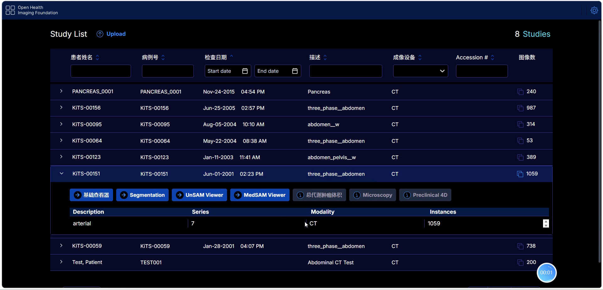

<div align="center">

#  Medical AI Diagnostic Platform

[](https://python.org)
[](https://fastapi.tiangolo.com)
[](https://docker.com)
[](https://github.com/wasserth/TotalSegmentator)
[](https://groq.com)
[](LICENSE)

**Computer-Aided CT Analysis with Real-Time 3D Visualisation & Multi-Agent Report Generation**

</div>

---

<a href="https://github.com/ZexiLi429/Medical-AI-Diagnostic-Platform/issues/1#issue-5124351836">
  
</a>
<p align="center"><em>👆 Click the image to view the demo video (GitHub Issues)</em></p>

---

##  Overview

A dissertation platform integrating **117-class anatomical segmentation**, **box-guided lesion detection** (liver / lung / kidney), and **LLM-powered diagnostic report generation** into a unified CT analysis workflow. Designed for CPU-only deployment with adaptive Z-axis downsampling and dual-level inference caching.

## Architecture

```
OHIF/vtk.js Frontend (:3000)     ← 2D MPR + 3D Volume Rendering + Organ Meshes
        │
FastAPI Backend (:8004)          ← Orchestration · Caching · Coordinate Recovery
        │
   ┌────┼────┐
   ▼    ▼     ▼
Docker: TotalSegmentator v2 (117 organs + 3 lesion models)
Docker: Orthanc PACS (:8042)
Docker: MedSAM2 (:8003, interactive refinement)
        │
   Groq API → Llama 3.3 70B      ← Diagnostic Report Generation
```

##  Features

| Category | Capability |
|----------|------------|
|  **Segmentation** | 117 anatomical structures via TotalSegmentator v2 |
| **Lesion Detection** | Box-guided: liver lesions · lung nodules · kidney cysts |
|  **Semantic Queries** | Natural-language organ lookup (`"left lung"`, `"rib"`) |
|  **3D Visualisation** | vtk.js volume rendering with semi-transparent organ meshes |
|  **Report Generation** | Three-agent workflow: Analysis → Evaluation → Generation |
|  **Performance** | Adaptive Z downsampling · Dual-level cache · CPU-only |

##  Quick Start

### Prerequisites

- **Python 3.10+** · **Docker 24.0+** · **Node.js 18+**
- **Groq API key** ([free tier](https://console.groq.com))

### 1. Docker Containers

```bash
# Orthanc PACS
docker run -d --name orthanc --network=host jodogne/orthanc-plugins

# TotalSegmentator (auto-pulled by backend on first use)
docker pull wasserth/totalsegmentator:latest
```

### 2. Backend

```bash
python -m venv .venv && .venv\Scripts\activate
pip install -r requirements.txt
set GROQ_API_KEY=gsk_your_key
python totalseg_service.py          # → http://localhost:8004
```

### 3. Frontend

```bash
cd miscada-project-master
yarn install && yarn start          # → http://localhost:3000
```

### 4. Load Data

Upload DICOM to Orthanc (`:8042`) → open OHIF (`:3000`) → segmentation triggers automatically.

##  API Endpoints

| Method | Endpoint | Description |
|--------|----------|-------------|
| `POST` | `/segment_3d` | 117-organ segmentation → 3D meshes |
| `POST` | `/segment_by_name` | Query-specific organ (`"liver"`, `"left lung"`) |
| `POST` | `/segment_file` | Segment a NIfTI file directly |
| `POST` | `/segment_lesion` | Box-guided lesion detection |
| `POST` | `/analyze_lesions` | LLM: identify suspicious organs |
| `POST` | `/generate_report` | Full diagnostic report |
| `GET` | `/health` | Health check |

##  Key Results

| Metric | Value | Notes |
|--------|-------|-------|
| Processing Time | 1.3–5.8 min | 5 Orthanc cases, ≤400 slices |
| Kidney Dice | 0.76 ± 0.14 | KiTS19 NIfTI, provenance-matched GT |
| Coordinate Alignment | 0.00 mm origin delta | TS mesh ↔ DICOM world |
| Organ Classes | 117 | TotalSegmentator v2 |
| Lesion Models | 3 | Liver · Lung · Kidney |

→ Full data: [`result/experiment_results/`](result/experiment_results/)

##  Structure

```
├── totalseg_service.py      # FastAPI backend (port 8004)
├── demo.mp4 / demo.png      # Demo media
├── service/                 # Deployed service copy
├── test/                    # Experiment & evaluation scripts
├── figures/                 # Thesis figure generation
├── result/                  # Experimental results (JSON, CSV, NPY)
├── data/                    # Dataset download & lookup utilities
├── legacy/                  # Deprecated scripts
├── miscada-project-master/  # OHIF vtk.js frontend
├── MedSAM2/                 # MedSAM2 inference + report agent
├── MedSAM-main/             # MedSAM v1
└── MedSAM-LiteMedSAM/       # LiteMedSAM models
```

## License

MIT
